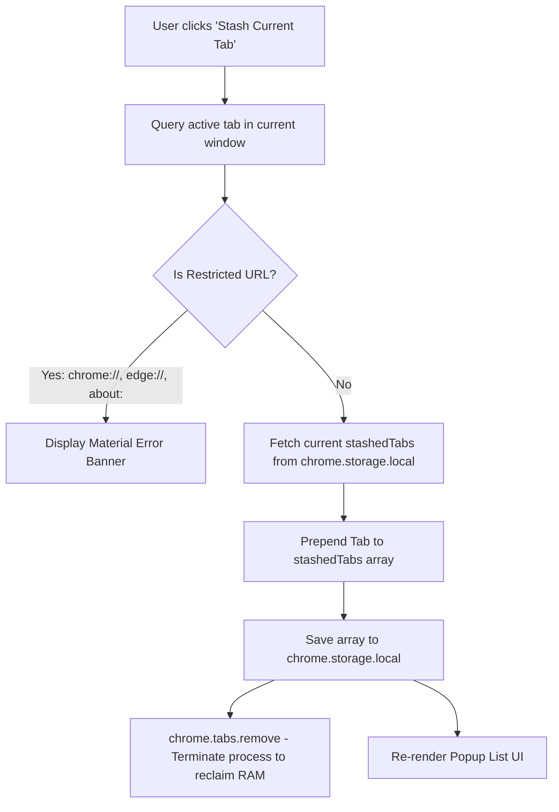

# Live Tab Stasher

A high-efficiency, lightweight Chromium Manifest V3 browser extension designed to eliminate excess RAM consumption by stashing inactive browser tabs into local session storage and terminating their processes immediately.

---

## Architectural Overview

Live Tab Stasher operates strictly within the Chromium client runtime without background service worker overhead or content-script injection. It utilizes synchronous execution paths and atomic storage transactions via `chrome.storage.local`.



### Component Structure

| File | Role | Technologies |
| :--- | :--- | :--- |
| [`manifest.json`](manifest.json) | Manifest V3 configuration and permission boundaries (`tabs`, `storage`). | JSON / Manifest V3 |
| [`popup.html`](popup.html) | View layer with strict 300px width and Material 3 Design design tokens. | HTML5, Vanilla CSS3 (M3 Tokens) |
| [`popup.js`](popup.js) | Tab query engine, restricted URL guard, and storage synchronization controller. | Vanilla JavaScript (ES2022) |

---

## Key Technical Specifications

- **Zero-Dependency Footprint**: Pure Vanilla HTML5, CSS3, and modern JavaScript. No bundlers, transpilers, or external runtime libraries.
- **Strict 300px Viewport**: Tailored to standard Chromium popup guidelines with smooth custom scrollbars and single-line ellipsis text truncation (`text-overflow: ellipsis`).
- **Material 3 Design System**: Native CSS variables implementing Google's Material Design tokens (elevation shadows, primary container colors, pill buttons, and responsive state layers).
- **Process Termination for Instant RAM Relief**: Invokes `chrome.tabs.remove(tabId)` immediately upon saving to storage, freeing browser memory.
- **Race-Condition Protection**: Reads fresh state from `chrome.storage.local` before applying mutations (`unshift` / `filter`), eliminating index shifting and state desynchronization.
- **Deterministic ID Addressing**: Items are assigned unique UUIDs (`crypto.randomUUID`) to guarantee collision-free deletions and restores.
- **Security Boundary Enforcement**: Detects and restricts privileged schemes (`chrome://`, `chrome-extension://`, `edge://`, `about:`, `view-source:`, `devtools://`).

---

## Installation & Setup

1. Clone or download this repository:
   ```bash
   git clone https://github.com/kisalnelaka/session-saver.git
   cd session-saver
   ```

2. Open Google Chrome (or any Chromium-based browser such as Brave, Edge, or Chromium).
3. Navigate to:
   ```text
   chrome://extensions
   ```
4. Enable **Developer mode** toggle in the top-right corner.
5. Click **Load unpacked**.
6. Select the `/home/kisalnelaka/Work/session-saver` directory.
7. Pin **Live Tab Stasher** to your browser toolbar.

---

## Usage Guide

### Stashing an Active Tab
1. Navigate to any standard web page.
2. Click the **Live Tab Stasher** toolbar icon.
3. Click **Stash Current Tab**.
4. The active tab closes immediately, freeing RAM, and appears at the top of your stashed list.

### Restoring a Stashed Tab
1. Open the extension popup.
2. Click on any item's title or icon in the list.
3. The URL launches in a new tab, and the record is removed from storage.

### Deleting Without Restoring
1. Hover over an item in the popup list.
2. Click the **✕** delete button on the right side.
3. The item is purged from `chrome.storage.local`.

---

## License

This project is licensed under the [MIT License](LICENSE).
