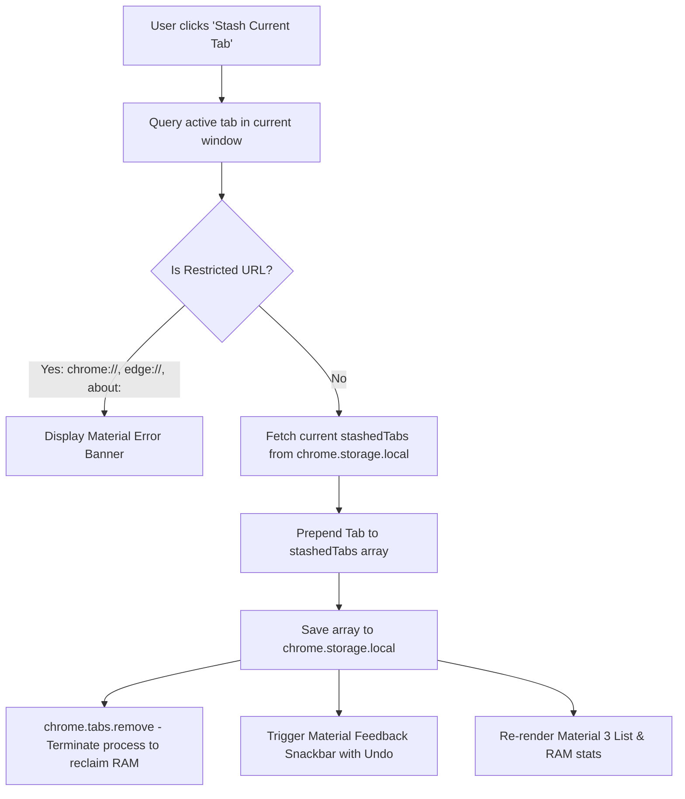

# Live Tab Stasher

A high-efficiency, lightweight Chromium Manifest V3 browser extension designed to eliminate excess RAM consumption by stashing inactive browser tabs into local session storage and terminating their processes immediately.

---

## Architectural Overview

Live Tab Stasher operates strictly within the Chromium client runtime without background service worker overhead or content-script injection. It utilizes synchronous execution paths and atomic storage transactions via `chrome.storage.local`.



### Component Structure

| File / Directory | Role | Technologies |
| :--- | :--- | :--- |
| [`manifest.json`](manifest.json) | Manifest V3 configuration, permission boundaries (`tabs`, `storage`), and multi-res icons. | JSON / Manifest V3 |
| [`popup.html`](popup.html) | View layer with 320px viewport, M3 elevation, light/dark mode tokens, search bar, and snackbar. | HTML5, Vanilla CSS3 (M3 Tokens) |
| [`popup.js`](popup.js) | Tab query engine, process termination, search filtering, batch restore, and Undo snackbar. | Vanilla JavaScript (ES2022) |
| [`icons/`](icons/) | Pixel-perfect anti-aliased icons (16px, 32px, 48px, 128px) for toolbar and Web Store. | PNG (Multi-res) |

---

## Key Technical Specifications & UX Features

- **Zero-Dependency Footprint**: Pure Vanilla HTML5, CSS3, and modern JavaScript. No external bundlers, frameworks, or CDN requests.
- **Material 3 Design System**:
  - **Dynamic Dark/Light Mode**: Matches browser system theme (`prefers-color-scheme: dark`) with authentic Material 3 color roles and surface elevations.
  - **High-DPI App Branding**: Custom vector-rendered squircle icons across 16px, 32px, 48px, and 128px.
  - **Live RAM Savings Indicator**: Computes real-time estimated RAM freed based on standard Chromium tab footprint (~95 MB/tab).
- **Process Termination for Instant RAM Relief**: Invokes `chrome.tabs.remove(tabId)` immediately upon saving to storage, freeing browser memory.
- **Instant Search & Filter**: Dynamically activates when multiple tabs are saved, providing real-time title and URL filtering.
- **Material Snackbar with Undo**: Allows one-click undo if a tab was stashed or removed accidentally.
- **Batch Operations**: "Restore All" action opens all stashed tabs while preserving order.
- **Rich Card Metadata**: Includes site favicons (with fallback vector monograms), domain names, and relative timestamps ("2m ago", "1h ago").
- **Deterministic ID Addressing**: Items are assigned unique UUIDs (`crypto.randomUUID`) to guarantee collision-free deletions and restores.
- **Security Boundary Enforcement**: Detects and restricts privileged schemes (`chrome://`, `chrome-extension://`, `edge://`, `about:`, `view-source:`, `devtools://`).

---

## Installation & Setup

1. Clone or download this repository:
   ```bash
   git clone https://github.com/kisalnelaka/session-saver.git
   cd session-saver
   ```

2. Open Google Chrome (or any Chromium-based browser such as Brave, Edge, or Chromium).
3. Navigate to:
   ```text
   chrome://extensions
   ```
4. Enable **Developer mode** toggle in the top-right corner.
5. Click **Load unpacked**.
6. Select the `/home/kisalnelaka/Work/session-saver` directory.
7. Pin **Live Tab Stasher** to your browser toolbar.

---

## Usage Guide

### Stashing an Active Tab
1. Navigate to any standard web page.
2. Click the **Live Tab Stasher** toolbar icon.
3. Click **Stash Current Tab**.
4. The active tab closes immediately, freeing RAM, and appears at the top of your stashed list with an undo snackbar prompt.

### Restoring a Stashed Tab
1. Open the extension popup.
2. Click on any item's title or icon in the list.
3. The URL launches in a new tab, and the record is removed from storage.

### Searching Stashed Tabs
1. Type in the search input box to instantly filter stashed tabs by title or domain.
2. Press `Escape` or click the **✕** button to clear the filter.

### Deleting & Undoing
1. Click the **✕** delete button on any item to remove it without opening.
2. If removed by mistake, click **Undo** on the bottom snackbar to restore it immediately.

---

## License

This project is licensed under the [MIT License](LICENSE).
