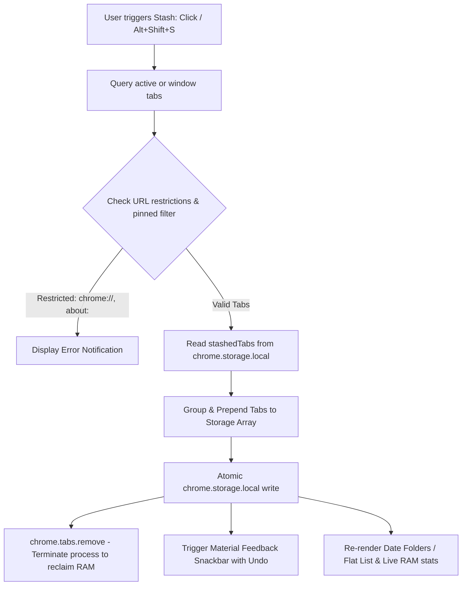

# Live Tab Stasher

[](https://github.com/kisalnelaka/live-tab-stasher/releases)
[](https://developer.chrome.com/docs/extensions/mv3/intro/)
[](LICENSE)
[]()

A high-performance, ultra-lightweight Chromium Manifest V3 browser extension designed to eliminate excess RAM consumption by stashing active and background browser tabs into persistent local storage and terminating their processes immediately.

Featuring chronological date folders, star prioritization, side panel docking, real-time search, multi-criteria sorting, and full data portability.

---

## Architectural Overview

Live Tab Stasher runs with minimal overhead within the Chromium client runtime. It pairs an ephemeral background service worker for global keyboard commands (`Alt+Shift+S`, `Alt+Shift+A`) with a responsive view layer capable of rendering as both a toolbar popup and a persistent browser Side Panel.



### Component Structure

| File / Directory | Role | Technologies |
| :--- | :--- | :--- |
| [`manifest.json`](manifest.json) | Manifest V3 specification, permissions (`tabs`, `storage`, `sidePanel`), background service worker, and commands. | JSON / Manifest V3 |
| [`background.js`](background.js) | Ephemeral service worker handling global keyboard commands and installation initialization. | Vanilla JavaScript (ES2022) |
| [`popup.html`](popup.html) | Modern Material 3 Expressive view (380px popup & 100% side panel responsive), settings deck, and folder accordions. | HTML5, Modern CSS3 |
| [`popup.js`](popup.js) | Date grouping engine, multi-mode sorting, domain filtering, batch window stashing, import/export, and Undo buffer. | Vanilla JavaScript (ES2022) |
| [`icons/`](icons/) | Pixel-perfect anti-aliased icons (16px, 32px, 48px, 128px). | PNG |
| [`CHROMEWEBSTORE.md`](CHROMEWEBSTORE.md) | Chrome Web Store listing metadata, permissions justifications, and privacy disclosures. | Markdown |

---

## Key Features & Capabilities

- **Chronological Date Folders**:
  - Automatically organizes stashed tabs into collapsible accordion folders: **Today**, **Yesterday**, **Previous 7 Days**, and **Older**.
  - Folder headers show tab counts, memory saved per group, and a one-click **"Restore Group"** button.
  - Smooth toggle switch between **Folder View** and continuous **Flat List View**.
- **Star & Pin Prioritization**:
  - Star any critical tab to lock it into a dedicated **Pinned Tabs ⭐** folder anchored at the top of the interface.
- **Side Panel Integration (`chrome.sidePanel`)**:
  - One-click dock into Chrome's native Side Panel so your stashed library stays open alongside web research without closing on window focus loss.
- **Bulk & Window Stashing**:
  - **Stash Current Tab**: Instantly closes the current tab to reclaim memory.
  - **Stash Window Tabs**: Closes all unpinned tabs across the active window with one click.
  - **Stash Other Tabs**: Keeps the active tab open while saving and closing all background tabs.
- **Smart Filtering & Multi-Mode Sorting**:
  - Dynamic **Domain Filter Chips** highlighting top saved sites (e.g. `github.com (6)`, `docs.google.com (4)`).
  - Sort by: **Newest First**, **Oldest First**, **By Domain**, and **Title (A-Z)**.
  - Instant substring search with keyboard quick-focus (`/`).
- **Dedicated Settings & Backup Screen**:
  - Preferences for default view mode, pinned browser tab protection, and memory termination rules.
  - **Export JSON**: Full backup of tab URLs, titles, favicons, and timestamps.
  - **Export Markdown**: Clean formatted markdown bookmark checklist.
  - **Import JSON**: One-click restore with automated URL deduplication.
  - **Clear Stash**: Bulk purge with confirmation modal and undo safety buffer.
- **Keyboard Shortcuts**:
  - `Alt + Shift + S`: Stash active tab immediately without opening popup.
  - `Alt + Shift + A`: Stash all tabs in current window immediately.
  - `/`: Quick-focus search input.
  - `Escape`: Clear search filter.

---

## Installation & Developer Setup

### Load Unpacked in Developer Mode

1. Clone or download this repository:
   ```bash
   git clone https://github.com/kisalnelaka/live-tab-stasher.git
   cd live-tab-stasher
   ```
2. Open Google Chrome (or any Chromium browser: Brave, Edge, Opera, Vivaldi).
3. Navigate to:
   ```text
   chrome://extensions
   ```
4. Enable the **Developer mode** toggle in the top-right corner.
5. Click **Load unpacked**.
6. Select the `live-tab-stasher` directory.
7. Pin **Live Tab Stasher** to your browser toolbar.

---

## Packaging for Release

To produce a clean zip archive for distribution or Web Store review:

```bash
zip -r live-tab-stasher-v1.2.0.zip manifest.json background.js popup.html popup.js icons/ LICENSE README.md CHROMEWEBSTORE.md
```

---

## License

This project is licensed under the [MIT License](LICENSE).
